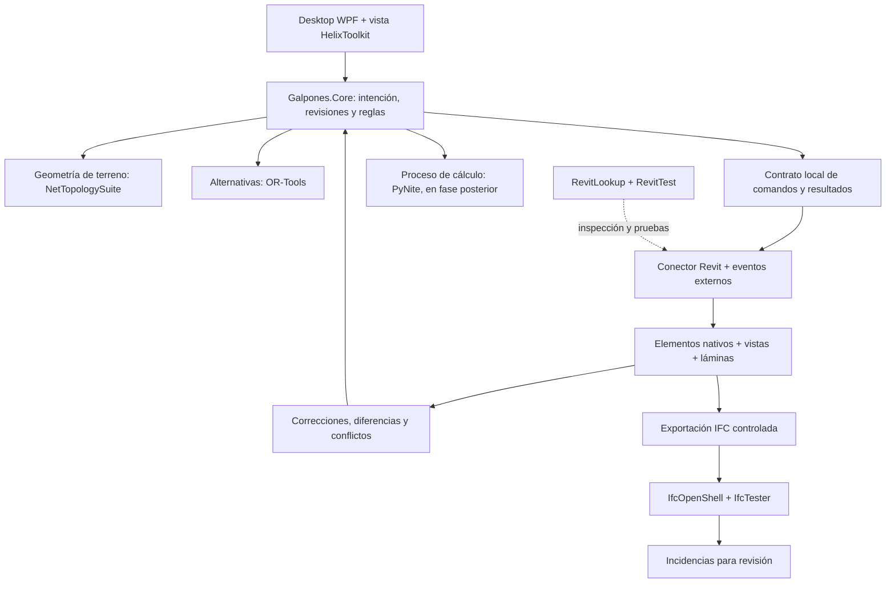

# Herramientas open source para MakerGalpones

Investigación: 19 de septiembre de 2026. Contexto: aplicación Windows C# / WPF / .NET 8, motor paramétrico propio y conector para Revit 2025.

## Decisión recomendada

Mantener la aplicación y el motor existentes. Incorporar herramientas por función, con prioridad en **producir un edificio editable, documentarlo y conservar las correcciones del arquitecto**. No encontré, entre los proyectos examinados, una solución abierta que resuelva ese recorrido completo para galpones y para los estándares de Mercado Libre.

La selección inicial es:

1. **RevitLookup + ricaun.RevitTest:** inspeccionar familias reales y verificar operaciones dentro de Revit.
2. **Nice3point.Revit.Toolkit:** evaluar sus utilidades y eventos externos para robustecer el conector. Revit.Async es una alternativa más acotada; no incorporar ambos para el mismo trabajo.
3. **pyRevit o DynamoRevit:** prototipar con el arquitecto las automatizaciones de documentación y descubrir qué reglas faltan. Elegir según las herramientas que ya maneje el equipo BIM.
4. **HelixToolkit:** evaluar una vista 3D interactiva dentro del desktop WPF.
5. **IfcOpenShell + IfcTester:** auditar una exportación IFC y devolver incidencias localizables.
6. **NetTopologySuite:** incorporar cuando pasemos del lote rectangular a terrenos y restricciones poligonales.
7. **OR-Tools y PyNite:** pruebas posteriores y separadas de alternativas y análisis estructural.

Son recomendaciones de arquitectura e integración, no resultados de rendimiento medidos. La matriz siguiente enlaza la evidencia de cada selección.

## Alcance y calidad de la investigación

Se consultaron repositorios, documentación de los mantenedores, licencias, páginas de versiones y ejemplos de uso. Además se verificaron por la API pública de GitHub los metadatos de **32 repositorios**, incluyendo archivo, rama predeterminada, licencia detectada y última actividad `pushed_at`. Se siguió también la migración de Revit MCP a su nuevo repositorio.

El [inventario de fuentes](OPEN-SOURCE-INVENTARIO.json) conserva esa consulta y las aclaraciones manuales de licencias. `NOASSERTION` significa que GitHub no identificó automáticamente una licencia; no significa que el proyecto no tenga licencia. `pushed_at` puede corresponder a cualquier rama o automatización: no es una versión estable, una auditoría de seguridad ni una medida suficiente de calidad.

Se contrastó el encaje con [el plan de trabajo](PLAN-DE-TRABAJO.md) y los proyectos locales. **No se instalaron ni ejecutaron estas bibliotecas en esta investigación.** La compatibilidad de integración y el ahorro siguen pendientes de los experimentos descritos al final. Las fuentes en ramas móviles pueden cambiar; al adoptar una dependencia se debe fijar versión y registrar la licencia de ese paquete y sus dependencias.

## 1. Automatización y documentación nativas de Revit

| Herramienta | Capacidad documentada y aplicación propuesta | Límite relevante | Licencia y decisión |
|---|---|---|---|
| [RevitLookup](https://github.com/lookup-foundation/RevitLookup) | Explorar elementos, parámetros y relaciones del documento. Usarlo para verificar hospedajes, tipos, referencias y parámetros del catálogo ML. | Es una herramienta de inspección para desarrollo/BIM; no genera el proyecto. | MIT. **Usar en desarrollo.** |
| [ricaun.RevitTest](https://github.com/ricaun-io/ricaun.RevitTest) | Pruebas NUnit con la API de Revit y soporte de varias versiones. Permite comprobar lo que los tests del Core no pueden observar. | Requiere entorno de Revit; preparar modelos de prueba, runner y configuración. No es Revit ejecutándose libre de licencia. | MIT. **Prueba de adopción prioritaria.** |
| [Nice3point.Revit.Toolkit](https://github.com/Nice3point/RevitToolkit) | Clases para comandos, carga y eventos externos, incluidos patrones asíncronos. Puede reducir código auxiliar del conector. | Elegir una versión para Revit 2025. Un evento externo no es transporte entre procesos, sincronización, control de conflictos ni API Revit en un hilo de cálculo. | MIT. **Preferido para evaluar en el conector.** |
| [Revit.Async](https://github.com/KennanChan/Revit.Async) | Envuelve eventos externos con `Task` y devuelve resultados al solicitante. | Su documentación aclara que no convierte la API de Revit en multihilo. Tampoco conecta por sí sola el ejecutable desktop con Revit. | MIT. **Alternativa al componente equivalente de Toolkit.** |
| [pyRevit](https://github.com/pyrevitlabs/pyRevit) | Entorno de automatización sobre Revit y herramientas disponibles para el equipo. Útil para ensayar tareas repetitivas y convertir criterios del arquitecto en operaciones reproducibles. | Los scripts, motores Python y versiones de Revit requieren control. Usar una herramienta instalada y copiar su código a MakerGalpones son decisiones de distribución diferentes. | GPL-3.0, ver [licencia](https://github.com/pyrevitlabs/pyRevit/blob/develop/LICENSE.rtf). **Laboratorio BIM y productividad inmediata.** |
| [DynamoRevit](https://github.com/DynamoDS/DynamoRevit) | Nodos y programación visual dentro de Revit. Adecuado para que el equipo BIM pruebe secuencias de generación, parámetros y documentación. | Versionar también paquetes y grafos. Apache en este repositorio no convierte Revit ni todas las dependencias geométricas o paquetes en componentes abiertos. | Apache-2.0. **Alternativa de prototipado; aprovechar grafos existentes.** |
| [BHoM + Revit_Toolkit](https://github.com/BHoM/Revit_Toolkit) | Modelo de objetos, adaptador, listener por sockets y conversiones `ToRevit` / `FromRevit`. Es un candidato serio para reutilizar integración BIM. | Introduce el ecosistema BHoM y sus dependencias. Su README anuncia Revit 2025/2026 pero también conserva instrucciones de .NET Framework: comprobar binarios y configuración actual. No asumir preservación de toda edición. | LGPL-3.0. **Experimento acotado antes de ampliar mucho nuestros conversores.** |

**Dónde se ahorra trabajo del arquitecto:** preparar vistas y láminas repetibles, parámetros, nomenclaturas, etiquetas y cantidades; después verificar lo generado. La API permite programar operaciones, pero las reglas de presentación del cliente deben aportarlas el catálogo y las plantillas. Una colección de botones no constituye todavía un generador documental de galpones.

Para el producto propondría que las operaciones aceptadas por el arquitecto tengan un contrato único en C#: entrada, precondiciones, elementos afectados, resultado y reversión. Los prototipos exitosos pasan a ese contrato mediante implementación propia o reutilización compatible con su licencia. Así la corrección de una lámina alimenta una regla verificable.

## 2. IFC, revisión BIM e intercambio

| Herramienta | Utilidad para MakerGalpones | Límite relevante | Licencia y decisión |
|---|---|---|---|
| [IfcOpenShell](https://github.com/IfcOpenShell/IfcOpenShell) | Leer, crear y procesar IFC; extraer información para una revisión independiente del RVT. Python/C++ y utilidades especializadas. | IFC no reproduce automáticamente familias editables, cotas, etiquetas, hospedajes ni historial de un RVT. | Núcleo y Python LGPL-3.0-or-later, con notas de dependencias. **Candidato principal para QA IFC.** |
| [IfcTester](https://docs.ifcopenshell.org/ifctester.html) | Validar IFC contra IDS y emitir resultados HTML, JSON, ODS o BCF. Ejemplo propuesto: exigir código de tipo, material y clasificación en cada columna exportada. | Audita requisitos de información. No deducir de un informe aprobado que cumplen estructura, incendios, geometría de maniobra o todos los planos. | LGPL-3.0-or-later según la [tabla por componentes](https://github.com/IfcOpenShell/IfcOpenShell). **Piloto junto con la exportación IFC.** |
| [IfcDiff, IfcPatch y BCF](https://github.com/IfcOpenShell/IfcOpenShell) | Comparar versiones IFC, aplicar transformaciones explícitas y transportar incidencias. | Una diferencia IFC no es un algoritmo de combinación de ediciones Revit. Una reparación de la exportación no corrige el RVT de origen. | LGPL-3.0-or-later para estos componentes. **Agregar cuando exista un caso específico.** |
| [Bonsai](https://docs.bonsaibim.org/) | Autoría y revisión de modelos IFC en Blender. Útil como herramienta independiente para inspeccionar la entrega abierta. | Es otro entorno de autoría. Adoptarlo como editor principal cambiaría el flujo del arquitecto y el producto comprometido. | GPL-3.0-or-later según el repositorio IfcOpenShell. **Herramienta externa de revisión.** |
| [xBIM Essentials](https://github.com/xBimTeam/XbimEssentials) | Alternativa .NET para trabajar con datos IFC, con menor cruce de lenguajes para nuestro equipo. | Evaluar aparte geometría, visualización y sus paquetes. No asumir equivalencia funcional con todas las utilidades IfcOpenShell. | [CDDL](https://raw.githubusercontent.com/xBimTeam/XbimEssentials/master/LICENCE.md). **Alternativa si evitar un proceso Python pesa más que sus utilidades.** |
| [Autodesk revit-ifc](https://github.com/Autodesk/revit-ifc) | Exportación y enlace IFC dentro de Revit, con configuración y extensiones abiertas. Primer punto a controlar para obtener un IFC auditable. | Depende de Revit. El repositorio incluye una DLL propietaria restringida al proyecto IFC. Hay discrepancia entre la descripción LGPLv2 del README y encabezados LGPL-2.1-or-later del código. | **Fijar versión del exportador y revisar componentes antes de redistribuir.** No hace falta mantener un fork inicialmente. |
| [Speckle](https://docs.speckle.systems/connectors/revit/revit) | Compartir modelos, versiones y visualización; interesante cuando varias personas revisen alternativas. | La documentación actual indica recepción como DirectShape por defecto, opción para bloques como familias y ausencia de escritura de propiedades recibidas a parámetros Revit. No resuelve nuestro contrato bidireccional. | Conectores .NET Apache-2.0. Servidor con base Apache-2.0 y directorios Enterprise. **Evaluar para colaboración, no como sustituto automático del conector.** |
| [That Open Components](https://github.com/ThatOpen/engine_components) + [web-ifc](https://github.com/ThatOpen/engine_web-ifc) | Aplicaciones BIM en navegador, lectura IFC, navegación y herramientas visuales. | Incorporarlo al desktop exigiría una superficie web y otro modelo de visualización. Sus cotas o exportación DXF no equivalen a documentación nativa RVT. | Components MIT; web-ifc MPL-2.0. **Reservar para revisión web o un visor IFC que realmente necesitemos.** |

[IDS de buildingSMART](https://github.com/buildingSMART/IDS) es un estándar de requisitos de información, no un motor de cálculo. Conviene expresar allí lo que corresponde a datos intercambiados y mantener reglas geométricas, técnicas y documentales en verificadores específicos.

**Decisión sobre Speckle:** sería prematuro hacerlo obligatorio para comunicación entre dos procesos locales. La ausencia de recepción de parámetros afecta directamente al caso “cambio una abertura y actualizo su familia y parámetros”. Debemos probar ese caso con las familias reales y conservar nuestro contrato de identidades. La [licencia del servidor](https://raw.githubusercontent.com/specklesystems/speckle-server/main/LICENSE) distingue módulos Enterprise; la [licencia del conector](https://raw.githubusercontent.com/specklesystems/speckle-sharp-connectors/main/LICENSE) es independiente.

## 3. Geometría, alternativas y visualización

| Herramienta | Aplicación propuesta | Límite e integración | Licencia y decisión |
|---|---|---|---|
| [HelixToolkit](https://github.com/helix-toolkit/helix-toolkit) | Vista 3D WPF con navegación y selección de elementos generados; resaltar pendientes y correcciones. | Es visualización. Mantener en Core la identidad y los parámetros de cada objeto. Evaluar render, selección y memoria con modelos representativos. | MIT. El proyecto concentra desarrollo en v3; v2 está en mantenimiento. **Preferido para la UI actual.** |
| [NetTopologySuite](https://github.com/NetTopologySuite/NetTopologySuite) | Operaciones 2D para polígonos de lote, intersecciones, áreas y envolventes admisibles. | Usar coordenadas proyectadas en metros y un contrato explícito de tolerancias. Los retiros por frente/lateral/fondo no siempre se resuelven con un único offset uniforme. | [Licencia BSD de tres cláusulas y avisos adicionales](https://raw.githubusercontent.com/NetTopologySuite/NetTopologySuite/develop/License.md). **Preferido para terreno y restricciones.** |
| [Clipper2](https://github.com/AngusJohnson/Clipper2) | Recorte, offset y triangulación de polígonos; implementación C# disponible. | Alternativa más acotada si sólo necesitamos operaciones poligonales. Evitar dos motores para la misma geometría sin una razón comprobada. | Boost Software License 1.0, `BSL-1.0`. **Alternativa a NTS para casos simples.** |
| [OR-Tools](https://github.com/google/or-tools) | Elegir módulos, cantidad de pórticos, posiciones discretas de docks o combinaciones de catálogo sujetas a restricciones. | El solver necesita una formulación nuestra. En [CP-SAT](https://developers.google.com/optimization/cp/cp_solver) las restricciones son enteras; distinguir factible, óptimo e indeterminado al vencer el tiempo. Hay API C#. | Apache-2.0. **Primera opción para alternativas discretas.** |
| [pymoo](https://github.com/anyoptimization/pymoo) | Explorar compromisos entre varias métricas cuando haya evaluadores fiables de costo, área, recorridos o desempeño. | Proceso Python adicional. Los métodos heurísticos no ofrecen por sí solos prueba de óptimo global; validar las restricciones de cada alternativa. | Apache-2.0. **Posterior a OR-Tools o si el problema es principalmente continuo y multiobjetivo.** |
| [CadQuery](https://cadquery.readthedocs.io/en/latest/intro.html) | Sólidos paramétricos mediante Python para piezas especiales y geometría de fabricación. | Un sólido CAD no contiene automáticamente la semántica de una familia Revit ni su documentación. Evaluar las dependencias OCCT del paquete. | [Apache-2.0](https://raw.githubusercontent.com/CadQuery/cadquery/master/LICENSE). **Para componentes específicos.** |
| [FreeCAD](https://github.com/FreeCAD/FreeCAD) | Plataforma CAD paramétrica abierta y programable; candidata para una futura vía de trabajo independiente de Revit. | Incorporar otro editor completo ahora aumenta el alcance y exige otro proceso de documentación/interoperabilidad. | LGPL-2.1 en el repositorio principal; revisar módulos. **Ruta alternativa, sin migrar el piloto actual.** |
| [Rhino.Inside.Revit](https://www.rhino3d.com/features/rhino-inside/) | Integrar Rhino/Grasshopper y operaciones nativas Revit cuando ya existe ese conocimiento en el equipo. | El conector abierto depende del entorno comercial Rhino y de Revit. No clasificar la solución completa como libre. | [Conector MIT](https://github.com/mcneel/rhino.inside-revit). **Condicional a licencias y experiencia existentes.** |

“Mejor alternativa” debe convertirse en restricciones duras y métricas explícitas. Propuesta: descartar primero invasión de retiros y conflictos de circulación; después comparar área útil, cantidad de docks, recorrido operativo, estructura y costo estimado. No mezclar metros, dinero y tiempos en una puntuación arbitraria presentada como una decisión técnica universal.

## 4. Análisis estructural

| Herramienta | Capacidad y uso propuesto | Lo que falta | Licencia y decisión |
|---|---|---|---|
| [PyNite](https://github.com/JWock82/Pynite) | Análisis de estructuras 3D con barras, cargas, combinaciones y resultados de esfuerzos/desplazamientos; documenta también análisis P-Delta y otras extensiones. | Traducir estructura física a modelo analítico, apoyos, liberaciones, arriostramiento y cargas. Validar las funciones utilizadas contra casos independientes. No se identificó aquí un flujo completo verificado de dimensionado CIRSOC para nuestros galpones. | MIT. **Primer candidato para un piloto de pórtico mediante proceso Python.** |
| [sectionproperties](https://github.com/robbievanleeuwen/section-properties) | Propiedades de secciones de geometría arbitraria mediante análisis numérico. | Propiedades de sección no equivalen a resistencia reglamentaria de un miembro o unión. Para perfiles de catálogo puede bastar una base aprobada. | MIT. **Complemento cuando el catálogo no alcanza.** |
| [OpenSees / OpenSeesPy](https://opensees.github.io/OpenSeesDocumentation/developer/license.html) | Ecosistema de análisis estructural con capacidades avanzadas, candidato técnico para necesidades que superen el piloto. | La licencia exige atender restricciones de incorporación y distribución comercial. OpenSeesPy menciona expresamente aplicaciones y servicios comerciales que lo importen. No confundir uso interno con redistribución de MakerGalpones. | Licencias específicas; [OpenSeesPy](https://github.com/zhuminjie/OpenSeesPyDoc/blob/master/LICENSE). **Fuera de la selección redistribuible inicial.** |

El motor numérico es sólo una parte. Para un resultado técnico útil faltan las acciones aplicables, combinaciones, propiedades de materiales, estabilidad, resistencia de miembros, uniones y fundaciones, más los criterios de servicio. Cada verificación debe mostrar alcance, hipótesis y revisión responsable. Una capacidad anunciada por una biblioteca no valida nuestra implementación.

## 5. Terreno, ubicación y operación logística

| Herramienta | Qué puede aportar | Qué no viene incluido | Licencia y decisión |
|---|---|---|---|
| [QGIS](https://qgis.org/project/overview/) | Preparación y revisión de información geográfica; capas y archivos del terreno que se entregan al configurador. | Catastro, normativa vigente, topografía precisa y datos operativos deben provenir de fuentes identificadas. | GPL-2.0 en metadatos del repositorio. **Herramienta externa antes que incrustar todo QGIS.** |
| [GDAL](https://gdal.org/en/stable/) | Lectura, conversión y procesamiento de datos geográficos raster/vector. | Empaquetar componentes nativos y probar formatos, coordenadas y unidades. No es una interfaz de mapas. | [Principalmente MIT/X y avisos por componentes](https://raw.githubusercontent.com/OSGeo/gdal/master/LICENSE.TXT). **Cuando haya importación GIS real.** |
| [MapLibre GL JS](https://maplibre.org/maplibre-gl-js/docs/) | Interfaz de mapa para visualizar terreno y contexto; se podría alojar en una superficie web del desktop. | No incluye por sí solo imágenes satelitales, tráfico, topografía, límites legales ni derecho de uso de los datos. La edición del polígono también necesita implementación o un componente adicional. | [BSD-3-Clause y avisos incluidos](https://raw.githubusercontent.com/maplibre/maplibre-gl-js/main/LICENSE.txt). **Candidato para el mapa.** |
| [SUMO](https://sumo.dlr.de/docs/index.html) | Simulación microscópica de tránsito y personas, con escenarios y demanda. Evaluar colas y accesos cuando Operaciones aporte datos. | No tomar una simulación vial como comprobación de la envolvente barrida de un camión articulado en una maniobra de dock. Son verificaciones distintas. | EPL-2.0; posibilidad de licencia secundaria GPL bajo sus condiciones. **P2, después de definir demanda y vehículos.** |

El emplazamiento requiere separar tres problemas: geometría admisible del edificio, maniobras físicas de vehículos y comportamiento temporal de flujos. Un mapa o un solver de tránsito no resuelve los tres. Para maniobras, queda pendiente seleccionar y validar un modelo cinemático y los vehículos de diseño; esta investigación no identificó un sustituto integrado y verificado para ese requisito.

## 6. IA y MCP: reutilización controlada

El [antiguo revit-mcp](https://github.com/mcp-servers-for-revit/revit-mcp) está archivado desde el 25/02/2026 y remite a un [repositorio unificado](https://github.com/mcp-servers-for-revit/mcp-servers-for-revit), MIT. Este último documenta un servidor TypeScript, un plugin C# y un conjunto de comandos que puede leer y modificar Revit. Hay operaciones para familias, elementos, cotas y etiquetas.

Eso lo hace interesante como referencia y como experimento posterior, pero conectar un modelo de lenguaje a esas operaciones no aporta por sí solo reglas constructivas, referencias estables ni una entrega documental correcta. La propuesta para MakerGalpones es exponer primero comandos acotados de nuestro motor: consultar, proponer cambios, revisar diferencias y aplicar una revisión identificada. Evitar que la lógica central dependa de código arbitrario generado durante cada ejecución.

No recomiendo incorporar un framework de agentes o una base vectorial al piloto sin una necesidad concreta. Antes necesitamos tipologías, catálogo, reglas y ejemplos aceptados. Registrar correcciones es útil desde ahora; entrenar modelos no es un requisito para aprovechar ese registro.

## 7. Qué arquitectura resulta de la investigación

Diagrama de una **propuesta**, no de componentes ya integrados:

Para el proceso Python propongo un ejecutable auxiliar con entrada/salida versionada en JSON y archivos de trabajo por ejecución, en lugar de cargar su entorno dentro del proceso Revit. Reduce el acoplamiento técnico; no elimina obligaciones de licencia ni el trabajo de distribución.

El modelo propio debe guardar identidad lógica, versión del generador, parámetros administrados y excepciones protegidas. El conector mantiene la correspondencia con elementos del documento. La sincronización debe comparar **estado base, propuesta MakerGalpones y edición Revit** antes de resolver conflictos. BHoM o Speckle podrían ayudar con partes de la infraestructura, pero esa política de producto debe definirse y probarse.

## 8. Mantenimiento y puntos de atención comprobados

Los valores completos están en el inventario. Algunas señales relevantes:

| Proyecto | Observación | Implicación |
|---|---|---|
| Revit Toolkit / RevitLookup | Actividad de repositorio el 16/09/2026; [Lookup publicó paquetes para Revit 2025 el 06/09/2026](https://github.com/lookup-foundation/RevitLookup/releases). | Buena señal para evaluar soporte actual; seleccionar el paquete del año correcto. |
| Revit.Async | Último `pushed_at` observado: 10/10/2025; no archivado. | Menor actividad reciente que Toolkit. No basta para declararlo abandonado. |
| ricaun.RevitTest | Último `pushed_at`: 13/04/2026. | Verificar funcionamiento del runner en nuestro Revit antes de adoptarlo en CI. |
| pyRevit / DynamoRevit | Actividad observada en septiembre de 2026. | Elegir versiones estables y motores compatibles; actividad no elimina regresiones. |
| HelixToolkit | Actividad el 01/09/2026; README distingue v2 en mantenimiento y desarrollo v3. | Evitar basar el visor nuevo en tutoriales antiguos sin comprobar el paquete. |
| IfcOpenShell | Actividad el 19/09/2026; documentación consultada 0.8.5. | No confundir la rama de desarrollo con la distribución estable elegida. |
| Revit MCP | Repositorio original archivado con migración explícita. | Investigar el sucesor; no presentar todo el proyecto como abandonado. |

Los [reportes de impresión de pyRevit](https://github.com/pyrevitlabs/pyRevit/issues/2970) ilustran por qué hay que probar tamaños de papel y márgenes con el rótulo del cliente. Un issue es evidencia de un caso reportado, no prueba de que todas las versiones o instalaciones fallen.

## 9. Licencias: decisiones específicas para este producto

Revit seguirá siendo una dependencia comercial. La selección abierta reduce desarrollo propio y dependencias adicionales, pero no convierte la cadena completa en software libre.

- **MIT, Apache-2.0, BSD y Boost:** mantener licencias y avisos exigidos al distribuir. Revisar también los paquetes transitivos y binarios nativos; el rótulo del repositorio no describe necesariamente todo el instalador.
- **LGPL, CDDL y MPL:** registrar qué componentes se enlazan, modifican o distribuyen y cumplir las condiciones de esas versiones. No tratarlas como MIT ni concluir automáticamente que obligan a abrir todo MakerGalpones.
- **GPL de pyRevit, Bonsai o QGIS:** decidir de forma explícita si serán herramientas externas o código incorporado/distribuido. Usarlas para producir archivos no equivale a copiar su implementación al producto. Separar procesos tampoco constituye por sí solo una conclusión sobre licencias.
- **Speckle:** diferenciar conectores, servidor base y módulos Enterprise. **Rhino.Inside:** separar licencia del conector y licencia de Rhino. **OpenSeesPy:** resolver autorización comercial antes de incorporarlo a una distribución.
- **revit-ifc:** revisar el alcance de su DLL propietaria y la discrepancia documental de versión LGPL en el artefacto exacto elegido. El [encabezado de código consultado](https://github.com/Autodesk/revit-ifc/blob/master/Source/Revit.IFC.Import/Data/IFCRepresentation.cs) expresa LGPL-2.1-or-later.

Estas observaciones delimitan la selección técnica. La aprobación de distribución debe basarse en un inventario del paquete final, no sólo en esta lista de candidatos.

## 10. Pruebas de adopción y orden de trabajo

Cada prueba debe terminar con un artefacto revisable y una decisión: adoptar, ajustar o descartar. Son trabajos propuestos; no ejecutados en esta investigación.

| Orden | Experimento y herramientas | Evidencia exigida para adoptarlas | Backlog asociado |
|---|---|---|---|
| 1 | **Una entrega documental real.** Elegir una nave y su plantilla. Inspeccionar con RevitLookup; usar pyRevit/Dynamo para ensayar tareas. Implementar una planta, dos cortes, una planilla y una lámina con operaciones repetibles. | RVT con objetos editables, PDF revisado por arquitecto, cantidades concordantes y registro del tiempo de configuración, generación, revisión y corrección. Los números de vistas son un alcance de prueba propuesto. | CAT-01, MOD-01, DOC-01, DOC-02, VAL-01 |
| 2 | **Preservación de correcciones.** Comparar conector actual + Toolkit frente a un subconjunto equivalente de BHoM. Cambiar longitud, tipo de abertura y una posición corregida manualmente. | Cero duplicados en repetición; corrección protegida conservada; conflictos visibles; cotas, etiquetas y hospedajes comprobados. RevitTest donde sea posible. Decidir BHoM por cobertura y esfuerzo real. | SYN-01/02/03, REV-01 |
| 3 | **Revisión IFC útil.** Exportar el mismo RVT y evaluar con IfcTester requisitos IDS acordados. Sembrar errores de material, clasificación y tipo. | Todos los errores sembrados dentro del alcance detectados; falsos positivos registrados; incidencias vinculadas al elemento Revit mediante correspondencia de identidades verificada. | REV-01, CAT-01, VAL-01 |
| 4 | **Visor y terreno.** HelixToolkit + NTS en una prueba separada. Cargar lote irregular, restricciones diferenciadas y un modelo representativo. | Selección por identidad, navegación usable, coherencia de unidades, intersecciones correctas y mediciones de tiempo/memoria en el equipo objetivo. Comparar también con el visor actual. | SIT-01, GEO-01 |
| 5 | **Alternativas discretas.** OR-Tools con módulos y familias del catálogo; comparar contra enumeración exhaustiva de un caso pequeño. | Alternativas factibles reproducibles; restricciones visibles; solución conocida recuperada en el caso pequeño; estado correcto al agotar tiempo o resultar inviable. | ALT-01 |
| 6 | **Cálculo de un pórtico.** PyNite con casos aprobados por ingeniería: carga vertical, lateral y sensibilidad de apoyos. | Equilibrio y esfuerzos/desplazamientos contrastados con solución independiente, tolerancias acordadas antes del ensayo, unidades y versión registradas. No habilitar dimensionado reglamentario por haber pasado sólo un caso numérico. | CAL-01 |

No hace falta incorporar las seis capas para demostrar valor. El primer recorrido debe reducir trabajo sobre una entrega comparable y el segundo impedir que regenerar destruya ese ahorro.

La métrica principal será `horas manuales de referencia - (preparación + generación + revisión + corrección con MakerGalpones)`. Registrar por separado desarrollo/configuración inicial y costo repetido por proyecto; amortizar el primero sobre el volumen esperado. No presentar un porcentaje de ahorro antes de medir dos o más proyectos representativos.

## Pendientes que ninguna biblioteca resuelve por nosotros

- Catálogo real, familias y parámetros compartidos aprobados por ML.
- Plantillas de vistas, rótulos, nomenclaturas, detalles y criterios de acotado.
- Contrato de correcciones y propiedad de cada parámetro entre aplicaciones.
- Reglas vigentes por jurisdicción y alcance técnico de cada verificación.
- Modelos de maniobra, demanda operativa y vehículos de diseño.
- Validación con arquitecto e ingeniería y medición del retrabajo.

La recomendación es cerrar primero documentación nativa y regeneración confiable, utilizando herramientas abiertas donde ya hay piezas maduras. La selección de motores de sitio, optimización y cálculo debe seguir las tareas que efectivamente consuman más tiempo en los proyectos de referencia.
